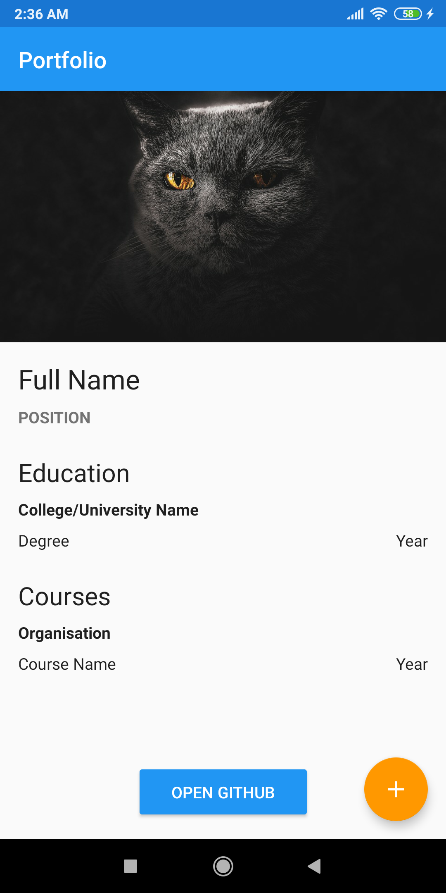

# Portfolio App

### Part 1
> [Portofolio Part 1 Branch](https://github.com/What-After-College/PortfolioApp/tree/portfolio-app-part-1)
- User Interface with static data

### Part 2
> [Portofolio Part 2 Branch](https://github.com/What-After-College/PortfolioApp/tree/portfolio-app-part-2)
- Add screen to Enter custom data
- Return data back for dynamic data view

  

### Part 3
> [[EXTRA] Portofolio Part 3 Branch](https://github.com/What-After-College/PortfolioApp/tree/portfolio-app-part-3)
- Data Binding to reduce `findViewById` calls
- Set data in one-line
- Lombok for removing POJO default getters, setters etc.
